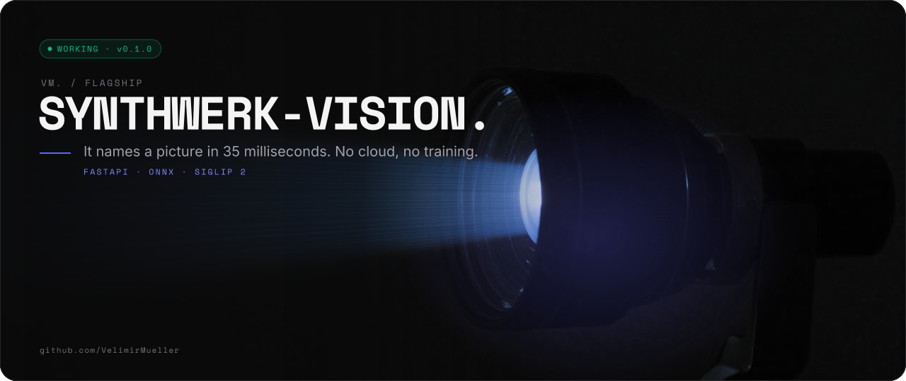
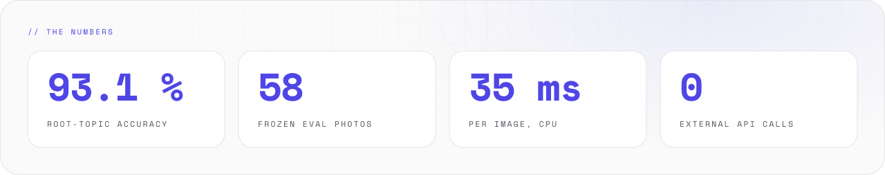
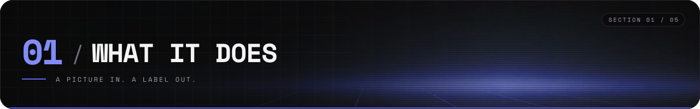
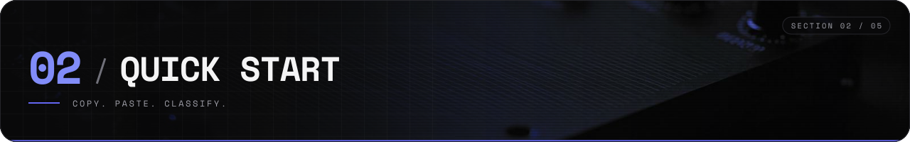
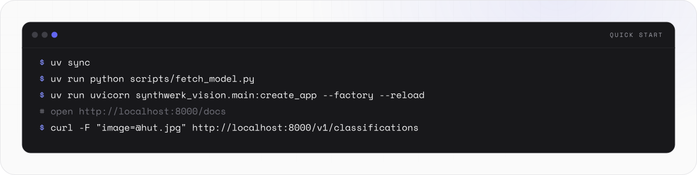
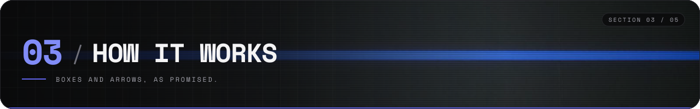
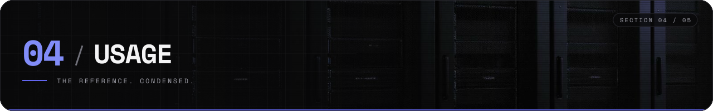
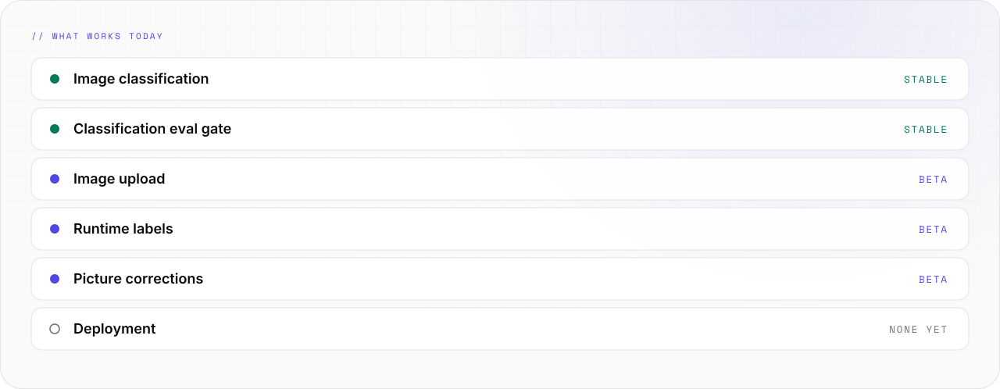

<picture>
  <source media="(prefers-color-scheme: light)" srcset="assets/banner/hero-v2-light.svg">
  
</picture>

<p align="center">
  [](#-05-status) [](https://github.com/VelimirMueller)  
</p>

> It names a picture in 35 milliseconds. No cloud, no training.

```text
 █████  ██  ██  ██  ██  ██████  ██  ██  ██   ██  ██████  █████   ██  ██
██      ██  ██  ███ ██    ██    ██  ██  ██   ██  ██      ██  ██  ██ ██
 ████    ████   ██████    ██    ██████  ██ █ ██  █████   █████   ████    █████
    ██    ██    ██ ███    ██    ██  ██  ███████  ██      ██ ██   ██ ██
█████     ██    ██  ██    ██    ██  ██   ██ ██   ██████  ██  ██  ██  ██
██  ██  ██████   █████  ██████   ████   ██  ██
██  ██    ██    ██        ██    ██  ██  ███ ██
██  ██    ██     ████     ██    ██  ██  ██████
 ████     ██        ██    ██    ██  ██  ██ ███
  ██    ██████  █████   ██████   ████   ██  ██  ██

 ------  open-vocabulary image labels, on cpu  -----------------------------
```

**synthwerk-vision** gives one image a label and the label's place in a topic tree
(`hut → building → building and structure`). A label is a text, so a new label needs no training.
It does one thing, on CPU, and does not want to talk about it.

<picture>
  <source media="(prefers-color-scheme: dark)" srcset="assets/readme/stats-v2-dark.svg">
  
</picture>

<br>

## // 01 WHAT IT DOES



<picture>
  <source media="(prefers-color-scheme: dark)" srcset="assets/readme/features-v2-dark.svg">
   building -> building and structure. RUNS ON CPU: ONNX Runtime, about 35 ms per image on an M-series Mac. No GPU, no external API" src="assets/readme/features-v2-light.svg" width="100%">
</picture>

- **Open vocabulary.** A label is a text, so a new label needs no training or new weights.
- **A topic tree.** Every label has a place: `beagle → dog → mammal → animal`.
- **Runs on CPU.** ONNX Runtime, about 35 ms per image on an M-series Mac. No GPU, no external API.
- The eval gate scores **93.1 %** root-topic accuracy on 58 frozen photos. CI fails below 90 %.

<br>

## // 02 QUICK START



<picture>
  <source media="(prefers-color-scheme: dark)" srcset="assets/readme/start-v2-dark.svg">
  
</picture>

Needs [uv](https://docs.astral.sh/uv/) and Python 3.12.

```bash
uv sync                                  # install runtime + dev dependencies from uv.lock
uv run python scripts/fetch_model.py     # both backends, pinned + SHA-256 verified (~1.5 GB)
                                         # or: fetch_model.py siglip | fetch_model.py mobilenet
uv run uvicorn synthwerk_vision.main:create_app --factory --reload
```

Open http://localhost:8000/docs, or:

```bash
curl -F "image=@hut.jpg" http://localhost:8000/v1/classifications
```

The first start embeds all label texts once (about 9 s on an M-series CPU) and caches them in
`models/label_cache/`. Later starts take about 0.5 s.

With Docker (weights are fetched and the label cache is built at image build time):

```bash
docker build -t synthwerk-vision .                                     # SigLIP (default)
docker build --build-arg BACKEND=mobilenet -t synthwerk-vision:small . # 14 MB of weights
docker run -p 8000:8000 -v synthwerk-vision-uploads:/data/uploads synthwerk-vision
```

<br>

## // 03 HOW IT WORKS



<picture>
  <source media="(prefers-color-scheme: dark)" srcset="assets/readme/flow-v2-dark.svg">
   MODEL -> TAXONOMY -> RESPONSE. The model scores every label. The taxonomy sums the scores into a topic path." src="assets/readme/flow-v2-light.svg" width="100%">
</picture>

```text
┌──────────┐   ┌──────────┐   ┌──────────┐   ┌──────────┐
│  image   │-->│  model   │-->│ taxonomy │-->│ response │
│  jpg     │   │ SigLIP 2 │   │  topic   │   │  label   │
│  png     │   │  ONNX    │   │  tree    │   │ + topic  │
│  webp    │   │  fp32    │   │ roll-up  │   │  path    │
└──────────┘   └──────────┘   └──────────┘   └──────────┘
```

- The model scores every label. The score of a topic is the sum of its labels.
- The response carries the best label, its topic path, the top-k labels and the topics.
- `uncertain` turns true when the root topic score is too low. Read it before you trust the answer.

<br>

## // 04 USAGE



### The API

- `GET /health` — liveness, and whether the model is loaded.
- `POST /v1/classifications` — classify an image (not stored).
- `POST /v1/images` — store an image, return its id.
- Admin `POST /v1/labels`, `GET /v1/labels`, `DELETE /v1/labels/{id}`, `POST /v1/feedback` need `SYNTHWERK_VISION_ADMIN_TOKEN`.

### Two backends

- `siglip` (default) — SigLIP 2 base/16, open vocabulary, ~1.5 GB of weights.
- `mobilenet` — MobileNetV2-12, 1000 ImageNet classes, 14 MB of weights.

### Configuration

- Every setting is an env var with the prefix `SYNTHWERK_VISION_`. See [`.env.example`](.env.example).
- The old prefixes `AURORAE_` and `AURORA_` are ignored. Rename them in every `.env` and deployment.

The full reference — every endpoint, response field, taxonomy rule, correction, env var, the dev
tree and the deploy plan — is in [docs/REFERENCE.md](docs/REFERENCE.md). The feature docs are in
[docs/features/](docs/features/).

<br>

## // 05 STATUS


<picture>
  <source media="(prefers-color-scheme: dark)" srcset="assets/readme/status-v2-dark.svg">
  
</picture>

```text
[ NOW   ]  working, v0.1.0
[ WORKS ]  classification, eval gate
[ NEXT  ]  deployment, contracts
```

```bash
uv run pytest                                              # tests, coverage gate 90 %
uv run ruff check . && uv run ruff format --check .        # lint and format
uv run mypy                                                # strict types
uv run python scripts/evaluate.py --min-topic-accuracy 0.9 # eval gate
```

<br>

```text
-- EOF --------------------------------------- IT KNOWS WHAT A HUT IS --
```

---

<sub>VM. studio / flagship · open source · look per <code>vm-brand</code> playbook · [MIT](LICENSE) © 2026 Velimir Mueller</sub>
